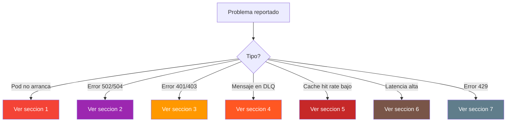
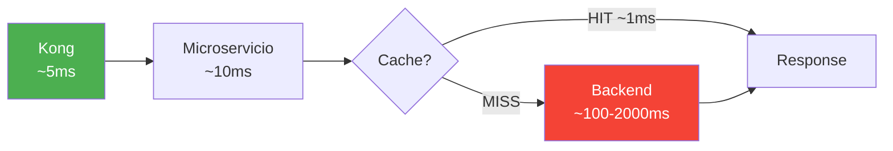

# Runbook / Troubleshooting

[Volver al indice](/)

---

## Diagnostico Rapido



---

## 1. Pod en CrashLoopBackOff

**Sintoma:** El pod se reinicia continuamente. Kubernetes muestra `CrashLoopBackOff`.

**Checklist:**

```bash
# 1. Ver estado del pod
kubectl get pods -n vip-catastro

# 2. Ver logs del pod que falla
kubectl logs vip-catastro-service-consulta-xxxxx -n vip-catastro --previous

# 3. Ver eventos del pod
kubectl describe pod vip-catastro-service-consulta-xxxxx -n vip-catastro
```

**Causas comunes:**

| Causa | Que buscar en los logs | Solucion |
|-------|----------------------|----------|
| BD no disponible | `Connection refused :5432` | Verificar que RDS esta activo y el Security Group permite trafico |
| Redis no disponible | `Connection refused :6379` | Verificar pod de Redis en namespace `redis` |
| RabbitMQ no disponible | `Connection refused :5672` | Verificar pod de RabbitMQ en `rabbitmq-system` |
| OOM (Out of Memory) | `OOMKilled` en describe | Aumentar `resources.limits.memory` en el deployment |
| Config incorrecta | `IllegalArgumentException`, `BeanCreationException` | Revisar ConfigMap y variables de entorno |
| Imagen no encontrada | `ErrImagePull`, `ImagePullBackOff` | Verificar tag de imagen en ECR y permisos de pull |

---

## 2. Error 502 / 504 (Integracion)

**Sintoma:** Kong retorna 502 (Bad Gateway) o 504 (Gateway Timeout).

**Checklist:**

```bash
# 1. Verificar que el microservicio esta corriendo
kubectl get pods -n vip-catastro -l app=vip-catastro-service-consulta

# 2. Verificar que el Service de K8s resuelve
kubectl get svc -n vip-catastro

# 3. Probar conectividad desde Kong al microservicio
kubectl exec -it kong-xxxxx -n kong -- curl http://vip-catastro-service-consulta.vip-catastro.svc.cluster.local:8080/actuator/health

# 4. Ver logs del microservicio
kubectl logs -l app=vip-catastro-service-consulta -n vip-catastro --tail=100

# 5. Ver logs de Kong
kubectl logs -l app=kong -n kong --tail=100
```

**Causas comunes:**

| Causa | Diagnostico | Solucion |
|-------|------------|----------|
| Microservicio caido | `0/2 pods ready` | Ver seccion 1 (CrashLoopBackOff) |
| Readiness probe falla | Pod running pero 0/1 ready | Verificar conexion a BD/Redis/RabbitMQ |
| Backend externo caido | Logs: `INT-001`, `Connect timeout` | Verificar alcance de red al backend (IGAC, SNR) |
| Backend lento | Logs: `INT-002`, `Read timeout` | Aumentar timeout del adaptador o contactar al equipo del backend |
| Network Policy bloqueando | No hay logs de error | Verificar NetworkPolicy permite trafico de `kong` al namespace |

---

## 3. Error 401 / 403 (Seguridad)

**Sintoma:** El consumidor recibe error de autenticacion o autorizacion.

**Checklist:**

```bash
# 1. Verificar que Keycloak esta activo
kubectl get pods -n keycloak

# 2. Probar el token manualmente
curl -s https://{keycloak-url}/realms/{realm}/.well-known/openid-configuration

# 3. Decodificar el JWT del consumidor (usar jwt.io o similar)
# Verificar: exp (no expirado), roles, audience

# 4. Ver logs de Kong (plugin OIDC)
kubectl logs -l app=kong -n kong --tail=50 | grep -i "auth\|oidc\|401\|403"
```

**Causas comunes:**

| Error | Codigo | Causa | Solucion |
|-------|--------|-------|----------|
| SEC-001 | 401 | Token no enviado o formato invalido | Verificar header `Authorization: Bearer {token}` |
| SEC-003 | 401 | Token expirado | Renovar token con refresh_token o re-autenticar |
| SEC-002 | 403 | Usuario no tiene acceso al recurso | Verificar roles del usuario en Keycloak |
| SEC-004 | 403 | Rol insuficiente para la operacion | Asignar rol requerido en el realm de Keycloak |

---

## 4. Mensajes en DLQ (Dead Letter Queue)

**Sintoma:** Mensajes se acumulan en la DLQ de RabbitMQ.

**Checklist:**

```bash
# 1. Acceder a la consola de RabbitMQ
kubectl port-forward svc/rabbitmq-cluster -n rabbitmq-system 15672:15672
# Abrir http://localhost:15672

# 2. Ver la DLQ especifica
# Navegar a Queues > vip.catastro.mutacion.dlq

# 3. Inspeccionar un mensaje
# En la consola: Get Message(s) > Ack Mode: Nack requeue false > Get Message

# 4. Ver logs del consumer
kubectl logs -l app=vip-catastro-service-mutacion -n vip-catastro --tail=200 | grep -i "error\|exception\|failed"
```

**Causas comunes:**

| Causa | Que buscar | Solucion |
|-------|-----------|----------|
| Formato de mensaje invalido | `JsonParseException`, `DeserializationException` | Verificar que el publisher envia el formato correcto |
| Error de negocio no controlado | `NullPointerException`, `IllegalStateException` | Fix en el codigo del consumer, redesplegar |
| Backend no disponible | `ConnectException`, `TimeoutException` | Esperar a que el backend se recupere y reprocesar |
| Reintento agotado | Mensaje con header `x-death` count = 3 | Analizar causa raiz antes de reprocesar |

**Reprocesar mensajes de DLQ:**

```bash
# Mover mensajes de DLQ al queue original (desde RabbitMQ Management)
# Queue > vip.catastro.mutacion.dlq > Move messages
# Destination: vip.catastro.mutacion.queue
```

> **Precaucion:** antes de reprocesar, verificar que la causa raiz esta resuelta. De lo contrario los mensajes volveran a la DLQ.

---

## 5. Cache Hit Rate Bajo (< 80%)

**Sintoma:** Dashboard de Grafana muestra Redis hit rate por debajo del 80%.

**Checklist:**

```bash
# 1. Verificar metricas de Redis
kubectl exec -it redis-master-0 -n redis -- redis-cli INFO stats | grep -E "keyspace_hits|keyspace_misses"

# 2. Verificar keys activas
kubectl exec -it redis-master-0 -n redis -- redis-cli DBSIZE

# 3. Verificar evictions
kubectl exec -it redis-master-0 -n redis -- redis-cli INFO stats | grep evicted_keys

# 4. Verificar memoria
kubectl exec -it redis-master-0 -n redis -- redis-cli INFO memory | grep used_memory_human
```

**Causas comunes:**

| Causa | Diagnostico | Solucion |
|-------|------------|----------|
| TTL muy corto | Keys expiran antes de ser consultadas | Revisar TTL por categoria en [Cache Redis](estandares/cache-redis.md) |
| Invalidacion excesiva | Muchos eventos de actualizacion borrando keys | Verificar que los eventos de invalidacion son correctos |
| Evictions por memoria | `evicted_keys` > 0 | Aumentar `maxmemory` del Redis o revisar que no se estan cacheando datos innecesarios |
| Keys no se estan creando | `DBSIZE` muy bajo | Verificar que el microservicio esta usando Spring Cache correctamente |
| Datos nunca consultados dos veces | Consultas unicas por NPN diferente | Normal para consultas no repetitivas — no se puede mejorar el hit rate |

---

## 6. Latencia Alta

**Sintoma:** Tiempos de respuesta > 2 segundos en endpoints de consulta.

**Checklist:**

```bash
# 1. Verificar latencia en Kong (dashboard Grafana)
# Panel: Kong > Latency by Route

# 2. Verificar latencia del microservicio
kubectl logs -l app=vip-catastro-service-consulta -n vip-catastro --tail=50 | grep duration_ms

# 3. Verificar latencia de Redis
kubectl exec -it redis-master-0 -n redis -- redis-cli --latency

# 4. Verificar slow queries en PostgreSQL
# Revisar pg_stat_statements o logs de RDS
```

**Donde se pierde el tiempo:**



| Tramo | Latencia esperada | Si es mayor |
|-------|:-----------------:|-------------|
| Kong → Microservicio | < 10ms | Verificar Network Policies, DNS resolution |
| Redis GET/SET | < 1ms | Verificar estado del cluster Redis |
| Microservicio → Backend | < 500ms | Verificar red hacia backend, queries lentos |
| Serializacion JSON | < 5ms | Verificar que no se serializan objetos enormes |

---

## 7. Error 429 (Rate Limit)

**Sintoma:** El consumidor recibe HTTP 429 "Too Many Requests".

**Checklist:**

```bash
# 1. Verificar headers de rate limit en la respuesta
curl -v https://{kong-url}/vip/catastro/v1/predios 2>&1 | grep -i "x-ratelimit"
# X-RateLimit-Limit-Minute: 60
# X-RateLimit-Remaining-Minute: 0

# 2. Ver configuracion del plugin en Kong
kubectl exec -it kong-xxxxx -n kong -- kong config db_export | grep rate-limiting
```

**Soluciones:**

| Escenario | Accion |
|-----------|--------|
| Consumidor hace demasiadas requests | Implementar backoff en el cliente |
| Limite es muy bajo para el caso de uso | Ajustar `rate-limiting` en el route de Kong |
| Ataque o abuso | Verificar IP de origen, considerar bloqueo |

---

## 8. Comandos Utiles

### Kubernetes

```bash
# Estado general del cluster
kubectl get nodes
kubectl top nodes

# Pods por namespace
kubectl get pods -n vip-catastro
kubectl get pods -n kong
kubectl get pods -n redis
kubectl get pods -n rabbitmq-system

# Logs con follow
kubectl logs -f -l app=vip-catastro-service-consulta -n vip-catastro

# Port-forward para acceso local
kubectl port-forward svc/grafana 3000:80 -n monitoring        # Grafana
kubectl port-forward svc/rabbitmq-cluster 15672:15672 -n rabbitmq-system  # RabbitMQ
kubectl port-forward svc/redis-master 6379:6379 -n redis       # Redis
```

### Redis

```bash
# Conectar al Redis
kubectl exec -it redis-master-0 -n redis -- redis-cli

# Buscar keys por patron
KEYS vip:catastro:predio:*

# Ver TTL de una key
TTL vip:catastro:predio:05001010203040000000

# Borrar key manualmente
DEL vip:catastro:predio:05001010203040000000

# Ver estadisticas
INFO stats
INFO memory
```

### Logs en Grafana/Loki

```
# Filtrar logs por servicio
{namespace="vip-catastro", app="vip-catastro-service-consulta"}

# Filtrar errores
{namespace="vip-catastro"} |= "ERROR"

# Filtrar por correlation ID
{namespace="vip-catastro"} |= "550e8400-e29b-41d4-a716-446655440000"
```
