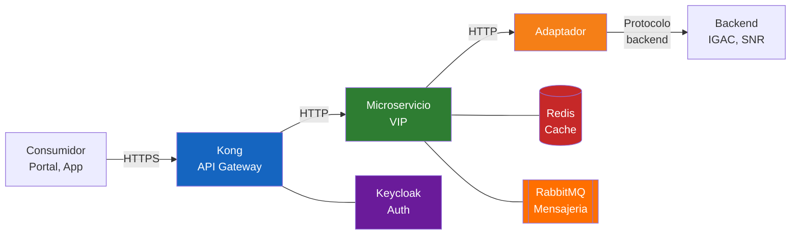
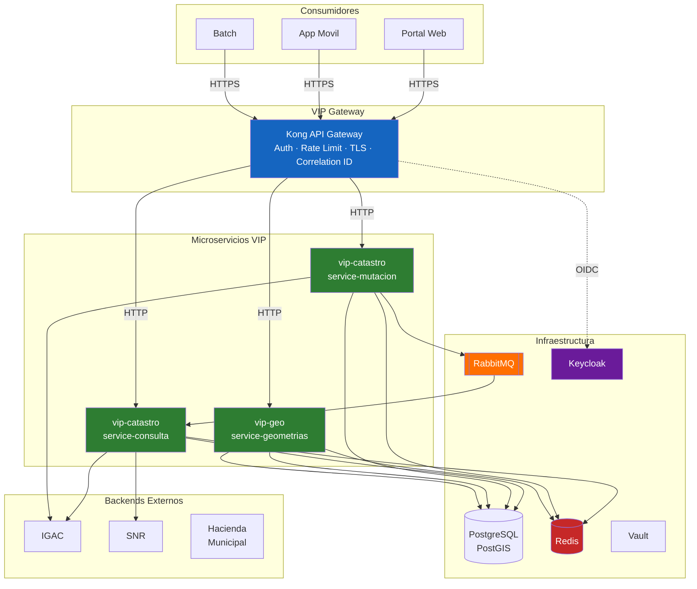
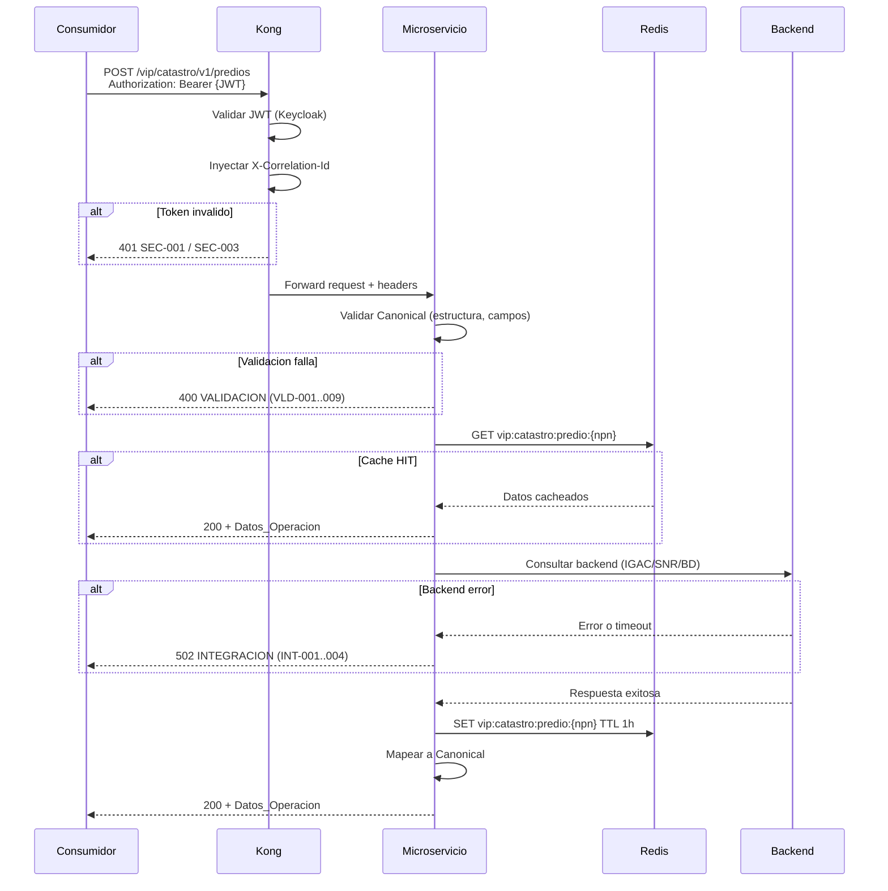
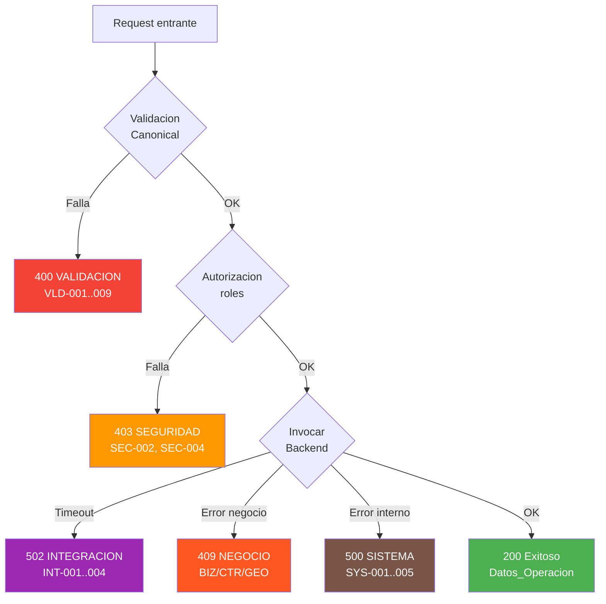
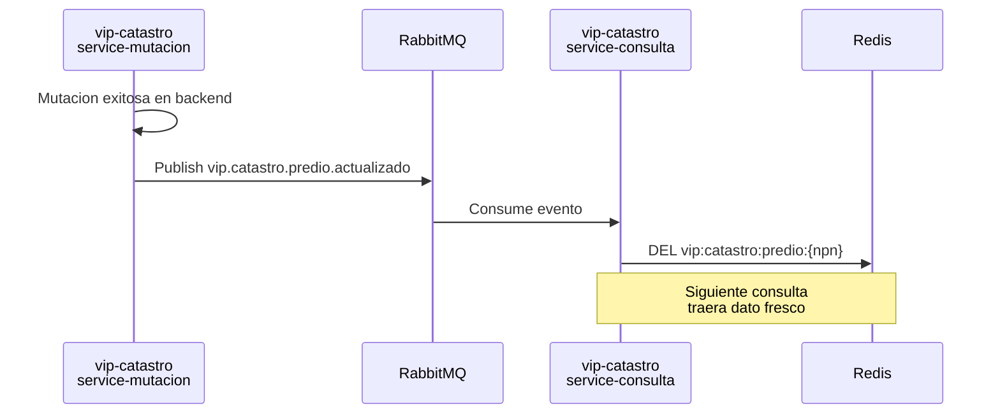

# Vortex Integration Platform (VIP)

[Volver al indice](/)

---

## Que es VIP

VIP (Vortex Integration Platform) es la plataforma de interoperabilidad desarrollada por Vortexbird S.A.S. para la Alcaldia de Medellin. Actua como **capa middleware** entre los sistemas consumidores (portales, aplicaciones moviles, sistemas internos) y los backends del dominio catastral.

### Que hace VIP

- **Estandariza** la comunicacion: todos los servicios usan el mismo [Canonical](contratos/canonical.md) de request/response.
- **Traduce** errores de los backends a un formato coherente y seguro via el [catalogo de errores](contratos/manejo-errores.md).
- **Valida** estructura, formato y campos requeridos antes de llegar al backend.
- **Cachea** datos parametricos y consultas frecuentes con [Redis](estandares/cache-redis.md).
- **Orquesta** procesos asincronos con [RabbitMQ](estandares/nombramiento-microservicios-colas.md).
- **Protege** los servicios con autenticacion [Keycloak](infraestructura/lineamientos-seguridad.md) y rate limiting via [Kong](infraestructura/lineamientos-kong.md).

### Que NO hace VIP

- No es el sistema catastral. VIP **media** entre consumidores y el sistema catastral.
- No almacena datos maestros. Los datos viven en los backends (IGAC, SNR, Hacienda).
- No reemplaza la logica de negocio del backend. Solo traduce, valida y enruta.

---

## Contexto: LADM-COL 4.1

La plataforma VIP opera en el contexto del modelo **LADM-COL (Land Administration Domain Model — Colombia) version 4.1**, el estandar colombiano de catastro multiproposito.

Esto impacta directamente en:

- **Nomenclatura de campos**: todos los campos del Canonical usan nombres en espanol con formato `Snake_Case` con mayuscula inicial, alineados con las entidades de LADM-COL.
- **Dominios funcionales**: catastro, geoespacial, urbanismo, hacienda — los mismos dominios del modelo LADM-COL.
- **Identificadores**: el NPN (Numero Predial Nacional) de 30 digitos asignado por IGAC es el identificador principal de un predio.

---

## Arquitectura de Alto Nivel

---

## Flujo de una Solicitud Tipica

---

## Flujo de Errores

---

## Flujo de Invalidacion de Cache

---

## Componentes Clave

| Componente | Tecnologia | Proposito | Doc |
|------------|------------|-----------|-----|
| API Gateway | Kong | Punto de entrada unico, auth, rate limiting | [Kong](infraestructura/lineamientos-kong.md) |
| Microservicios | Spring Boot 3 / Java 17 | Logica de interoperabilidad | [Naming](estandares/nombramiento-microservicios-colas.md) |
| Identidad | Keycloak | Autenticacion OIDC, roles | [Seguridad](infraestructura/lineamientos-seguridad.md) |
| Cache | Redis | Reducir carga a backends | [Cache](estandares/cache-redis.md) |
| Mensajeria | RabbitMQ | Procesos asincronos, invalidacion de cache | [Colas](estandares/nombramiento-microservicios-colas.md) |
| BD Espacial | PostGIS | Validacion de geometrias, consultas espaciales | — |
| Orquestacion | Kubernetes (EKS) | Despliegue, escalamiento, probes | [K8s](infraestructura/lineamientos-k8s.md) |
| Observabilidad | Prometheus + Grafana + Loki | Metricas, dashboards, logs | [Observabilidad](infraestructura/lineamientos-observabilidad.md) |
| Secretos | Vault | Gestion segura de passwords y tokens | [Seguridad](infraestructura/lineamientos-seguridad.md) |

---

## Entidades Externas

| Entidad | Sigla | Rol |
|---------|-------|-----|
| Instituto Geografico Agustin Codazzi | IGAC | Autoridad catastral nacional, provee datos de predios y NPN |
| Superintendencia de Notariado y Registro | SNR | Registro de propiedad, tradicion y libertad de inmuebles |
| Hacienda Municipal | — | Impuesto predial, liquidacion tributaria |
| Alcaldia de Medellin | — | Cliente, consumidor principal de los servicios VIP |
